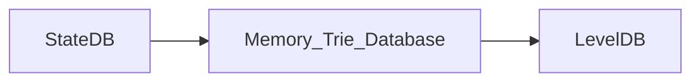
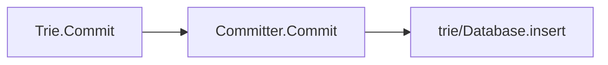

---
title: 02-状态管理

date: 2022-10-21	

categories: 以太坊源码	

tags: [区块链,以太坊源码]
---	

# 状态管理一: StateDB

 Ethereum State 管理模块中最重要的几个数据结构：**StateDB, Trie，StateTrie，以及 StackTrie**。我们将通过分析Ethereum中的主workflow的方式来深入理解这三个数据结构的使用场景，以及设计上的不同。

首先，**StateDB是这三个数据结构中最高层的封装**，它是**直接提供了与StateObject (Account，Contract)相关的 CURD 的接口**给其他的模块，比如：

- Mining 模块，执行新 Blockchain 中的交易形成新的 world state。
- Block 同步模块，执行新 Blockchain 中的交易形成新的 world state，与header中的 state root 进行比较验证。
- EVM 中的两个与 Contract 中的持久化存储相关的两个 opcode, sStore, sSload.

## StateDB：状态数据库

我们可以在 genesis block 创建的相关代码中，找到直接相关的例子。

```go
 statedb.Commit(false)
 statedb.Database().TrieDB().Commit(root,nil)
```

具体 World State 的更新顺序是:



StateDB 调用 `Commit` 的时候并没有同时触发 `TrieDB` 的 Commit 。

在Block被插入到 Blockchain 的这个Workflow中，**stateDB的commit首先在`writeBlockWithState`函数中被调用了**。之后`writeBlockWithState`函数会判断 `GC` 的状态来决定在本次调用中，**是否需要向 `Disk Database` 写入数据**。

### From Memory to Disk：存储到硬盘

当新的Block被添加到Blockchain时，State 的数据并不一会立即被写入到 Disk Database 中。在`writeBlockWithState`函数中，函数会判断 `gc` 条件，**只有满足一定的条件**，才**会在此刻调用 TrieDB 中的 `Cap` 或者 `Commit` 函数将数据写入Disk Database中**。

# 状态管理二: World State Trie and Storage Trie


## Trie 概述

**Trie 结构是 Ethereum 中用于管理数据的基本数据结构**，它被广泛的运用在Ethereum 里的多个模块中，包括管理全局的 **World State Trie**，管理 **Contract中持久化存储的Storage Trie**，以及每个 Block 中的**与交易相关的 Transaction Trie 和 Receipt Trie。**

在以太坊的体系中，广义上的 **Trie 的指的是 Merkel Patricia Trie(MPT)**这种数据结构。在实际的实现中，根据业务功能的不同，在 go-ethereum 中**一共实现了三种不同的MPT的instance**，分别是，`Trie`，`State Trie`(`Secure Trie`) 以及`Stack Trie`.

这些Trie在具体实现上的不同点在于，**Transaction Trie本质上并没有使用Trie来管理Transaction的数据**，而是**依赖于MPT的根来快速验证**，具体可以参考**core/types/hashing.go/DeriveSha()函数**来了解Transaction Trie 的**root是如何产生的**，这里的Trie使用的是Stack Trie。

从调用关系上看 `Trie` 是最底层的核心结构，它**用于之间负责 StateObject 数据的保存**，以及提**供相应的 CURD 函数**。它的定义在trie/trie.go文件中。

**State Trie 结构本质上是对 Trie 的一层封装**。它具体的CURD操作的实现都是通过`Trie`中定义的函数来执行的。它的定义在`trie/secure_trie.go`文件中。这个 Trie 也就是我们常说的World State Trie，它是**唯一的一个全局 Trie 结构**。与 Trie 不同的是，**Secure Trie要求新加入的Key-Value pair中的Key 的数据都是Sha过的。**这是为了防止恶意的构造Key来增加MPT的高度。

```go
type StateTrie struct {
 trie             Trie
 preimages        *preimageStore
 hashKeyBuf       [common.HashLength]byte
 secKeyCache      map[string][]byte
 secKeyCacheOwner *StateTrie // 指向self的指针，在不匹配时替换键缓存
}
```

**不管是Secure Trie还是Trie，他们的创建的前提是: 更下层的db的实例已经创建成功了，否则就会报错**。

值得注意的是一个**关键函数Prove(证明构造merkle关键证据。结果包含所有编码节点的路径在关键的值。价值本身也包含在最后一个节点,可以通过验证证明检索)的实现**，并不在这两个Trie的定义文件中，而是位于`trie/proof.go`文件中。

## Trie 运用

### Read Operation：读写行动

### Insert：插入

```go
func (t *Trie) insert(n node, prefix, key []byte, value node) (bool, node, error) {
	......
}
```

### Update：更新

### Delete：删除

### Finalize And Commit to Disk：存储到硬盘

- 在leveldb中保存的是Trie中的节点。
- <hash, node.rlprawdata>

在Geth中，Trie并不是实时更新的，而是依赖于Committer和Database两个额外的辅助单位。



我们可以看到Trie的Commit并不会真的对Disk Database的值进行修改。

Trie真正更新到Disk Database的，是依赖于`trie/Database.Commit`函数的调用。我们可以在诸多函数中找到这个函数的调用比如。

```go
func GenerateChain(config *params.ChainConfig, parent *types.Block, engine consensus.Engine, db ethdb.Database, n int, gen func(int, *BlockGen)) ([]*types.Block, []types.Receipts) {
  ...
   // Write state changes to db
   root, err := statedb.Commit(config.IsEIP158(b.header.Number))
   if err != nil {
    panic(fmt.Sprintf("state write error: %v", err))
   }
   if err := statedb.Database().TrieDB().Commit(root, false); err != nil {
    panic(fmt.Sprintf("trie write error: %v", err))
   }
   ...
}
```

## StackTrie

StackTrie虽然也是MPT结构，但是它与另外的两个Trie最大的不同在于，其**主要作用不是用于存储数据**，而是**用于给一组数据生成证明。**比如，在Block中的Transaction Hash以及Receipt Hash都是基于StackTrie生成的。这里我们使用一个更直观的例子。这个部分的代码位于*core/block_validator.go*中。在block_validator中定义了一系列验证用的函数, 比如`ValidateBody`和 `ValidateState`函数。我们选取了这两个函数的其中一部分，如下所示。为了验证Block的合法性，ValidateBody和ValidateState函数分别在本地基于Block中提供的数据来构造Transaction和Receipt的哈希来与Header中的TxHash与ReceiptHash。我们可以发现，**函数`types.DeriveSha`需要一个`TrieHasher`类型的参数**。但是在具体调用的时候，**却传入了了一个`trie.NewStackTrie`类型的变量**。这是因为StackTrie实现了TrieHasher接口所需要的三个函数，所以这种调用是合法的。我们可以在*core/types/hashing.go*中找到TrieHasher的定义。这里**`DeriveSha`不断的向StackTrie中添加数据，并最终返回StackTrie的Root哈希值**。

同时，我们可以发现，在**调用DeriveSha函数**的时候，我们**每次都会new一个新的StackTrie**作为参数。这也反映出了，**StackTrie的主要作用就是生成验证用的Proof，而不是存储数据。**

```golang
func (v *BlockValidator) ValidateBody(block *types.Block) error {
 ...
 if hash := types.DeriveSha(block.Transactions(), trie.NewStackTrie(nil)); hash != header.TxHash {
  return fmt.Errorf("transaction root hash mismatch: have %x, want %x", hash, header.TxHash)
 }
 ...
}
```

```golang
func (v *BlockValidator) ValidateState(block *types.Block, statedb *state.StateDB, receipts types.Receipts, usedGas uint64) error {
 ...
 // Tre receipt Trie's root (R = (Tr [[H1, R1], ... [Hn, Rn]]))
 receiptSha := types.DeriveSha(receipts, trie.NewStackTrie(nil))
 if receiptSha != header.ReceiptHash {
  return fmt.Errorf("invalid receipt root hash (remote: %x local: %x)", header.ReceiptHash, receiptSha)
 }
 ...
}

```

## State Trie的更新是什么时候发生的？

**State Trie的更新**，通常是**指的是基于State Trie中节点值的变化从而重新计算State Trie的Root的Hash值的过程**。目前这一过程是**通过调用StateDB中的`IntermediateRoot`函数来完成的。**

  我们从三个粒度层面来看待State Trie更新的问题。

- Block 层：
  **在一个新的Block Insert到Blockchain的过程中，State Trie可能会发生多次的更新**。比如，在每次Transaction被执行之后，**`IntermediateRoot`函数都会被调用**。同时，**更新后的 State Trie的Root值，会被写入到Transaction对应的Receipt中**。请注意，**在调用`IntermediateRoot`函数时，更新后的值在此时并没有被立刻写入到Disk Database中**。此时的State Trie Root只是基于内存中的数据计算出来的。**真正的Trie数据写盘，需要等到`trieDB.Commit`函数的执行。**
- Transaction 层：
  如上面提到的，在每次Transaction执行完成后，系统都会调用一次StateDB的`IntermediateRoot`函数，来更新State Trie。并且会将更新后的Trie的Root Hash写入到该Transaction对应的Receipt中。这里提一下关于`IntermediateRoot`函数细节。在`IntermediateRoot`函数调用时，会**首先更新被修改的Contract的Storage Trie的Root。**
- Instruction 层：
  执行Contract的Instruction，并不会直接的引发State Trie的更新。比如，我们知道，**EVM指令`OpSstore`会修改Contract中的持久化存储**。这个**指令调用了StateDB中的`SetState`函数**，并最终**调用了对应的StateObject中的`setState`函数**。StateObject中的`setState` 函数并没有直接对Contract的Storage Trie进行更新，而是**将修改的存储对象保存在了StateObject中的*dirtyStorage* 中**(*dirtyStorage*是用于缓存Storage Slot数据的Key-Value Map). **Storage Trie的更新是由更上层的函数调用所触发的，比如`IntermediateRoot`函数，以及`StateDB.Commit`函数。**

