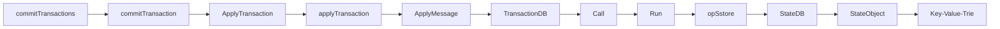

---
title: 03-Transaction交易

date: 2022-10-27	

categories: 以太坊源码	

tags: [区块链,以太坊源码]
---	

# Transaction: 一个交易的生老病死

## 概述

我们知道，**Ethereum的基本模型是基于交易的状态机模型**(Transaction-based State Machine)，Transaction是Ethereum执行数据操作的媒介，它主要起到下面的几个作用:

1. 在Layer-1网络上的Account之间进行Native Token的转账。
2. 创建新的Contract。
3. 调用Contract中会修改目标Contract中持久化数据或者间接修改其他Account/Contract数据的函数。

这里我们对Transaction的功能性的细节再进行一些额外的补充。首先，**Transaction只能创建Contract账户，而不能用于创建外部账户**(EOA)。第二，**如果调用Contract中的只读函数，是不需要构造Transaction**的。相对的，所有参与Account/Contract数据修改的操作都需要通过Transaction来进行。第三，广义上的Transaction只能由外部账户(EOA)构建。Contract是没有办法显式构造Layer-1层面的交易的。在某些合约函数的执行过程中，Contract在可以通过构造internal transaction来与其他的合约进行交互，但是这种Internal transaction与我们提到的Layer-1层面的交易有所不同，我们会在之后的章节介绍。

## LegacyTx & AccessListTX & DynamicFeeTx

```go
// core/types/transaction.go
type Transaction struct {
 inner TxData    // 交易的共识内容
 time  time.Time // 首次在本地看到的时间(避免垃圾邮件)

 // 缓存
 hash atomic.Value
 size atomic.Value
 from atomic.Value
}
```

这里我们需要重点关注一下`inner`这个变量。目前与Transaction直接相关的数据都由这个变量来维护。

目前，`TxData`类型是一个接口，它的定义如下面的代码所示。

```go
type TxData interface {
	txType() byte // returns the type ID
	copy() TxData // 创建一个深拷贝和初始化所有字段

	chainID() *big.Int
	accessList() AccessList
	data() []byte
	gas() uint64
	gasPrice() *big.Int
	gasTipCap() *big.Int
	gasFeeCap() *big.Int
	value() *big.Int
	nonce() uint64
	to() *common.Address
	blobGas() uint64
	blobGasFeeCap() *big.Int
	blobHashes() []common.Hash

	rawSignatureValues() (v, r, s *big.Int)
	setSignatureValues(chainID, v, r, s *big.Int)

	//在给定包含区块baseFee的情况下，计算交易支付的gas价格。
    //不像其他TxData方法，返回*大。Int应该是计算值的独立副本，即允许调用者改变结果。
    //方法实现可以使用'dst'来存储结果。
	effectiveGasPrice(dst *big.Int, baseFee *big.Int) *big.Int
}
```

原来的TxData现在被声明成了一个interface，是为了后续版本的更新中可以对Transaction类型进行更加灵活的修改。目前，在Ethereum中定义了三种类型的Transaction来实现TxData这个接口。按照时间上的定义顺序来说，这三种类型的Transaction分别是，LegacyT，AccessListTx，TxDynamicFeeTx。

LegacyTx：是原始的Ethereum的Transaction设计

AccessListTX：是基于EIP-2930(Berlin分叉)的Transaction。

DynamicFeeTx：是[EIP-1559](https://eips.ethereum.org/EIPS/eip-1559)(伦敦分叉)生效之后的默认的Transaction。

### LegacyTx

```go
type LegacyTx struct {
 Nonce    uint64          // nonce of sender account
 GasPrice *big.Int        // wei per gas
 Gas      uint64          // gas limit
 To       *common.Address `rlp:"nil"` // nil means contract creation
 Value    *big.Int        // wei amount
 Data     []byte          // contract invocation input data
 V, R, S  *big.Int        // signature values
}
```

### AccessListTX

```go
type AccessListTx struct {
 ChainID    *big.Int        // destination chain ID
 Nonce      uint64          // nonce of sender account
 GasPrice   *big.Int        // wei per gas
 Gas        uint64          // gas limit
 To         *common.Address `rlp:"nil"` // nil means contract creation
 Value      *big.Int        // wei amount
 Data       []byte          // contract invocation input data
 AccessList AccessList      // EIP-2930 access list
 V, R, S    *big.Int        // signature values
}
```

### DynamicFeeTx

如果我们观察DynamicFeeTx就会发现，DynamicFeeTx的定义其实就是在LegacyTx/AccessListTX的定义的基础上额外的增加了GasTipCap与GasFeeCap这两个字段。

```go
type DynamicFeeTx struct {
 ChainID    *big.Int
 Nonce      uint64
 GasTipCap  *big.Int // a.k.a. maxPriorityFeePerGas
 GasFeeCap  *big.Int // a.k.a. maxFeePerGas
 Gas        uint64
 To         *common.Address `rlp:"nil"` // nil means contract creation
 Value      *big.Int
 Data       []byte
 AccessList AccessList

 // Signature values
 V *big.Int `json:"v" gencodec:"required"`
 R *big.Int `json:"r" gencodec:"required"`
 S *big.Int `json:"s" gencodec:"required"`
}
```

## Transaction的执行流程

Transaction的执行主要在发生在两个Workflow中:

1. **Miner在打包新的Block时。此时Miner会按Block中Transaction的打包顺序来执行其中的Transaction。**
2. **其他节点添加Block到Blockchain时**。当**节点从网络中监听并获取到新的Block时，它们会执行Block中的Transaction**，来更新本地的State Trie的 Root，并与Block Header中的State Trie Root进行比较，来验证Block的合法性。

一条Transaction执行，可能会涉及到多个Account/Contract的值的变化，最终造成一个或多个Account的State的发生转移。在**Byzantium分叉之前的Geth版本中，在每个Transaction执行之后，都会计算一个当前的State Trie Root，并写入到对应的Transaction Receipt中。**这符合以太坊黄皮书中的原始设计。即交易是使得Ethereum状态机发生状态状态转移的最细粒度单位。读者们可能已经来开产生疑惑了，“每个Transaction都会重算一个State Trie Root”的方式岂不是会带来大量的计算(重算一次一个MPT Path上的所有Node)和读写开销(新生成的MPT Node是很有可能最终被持久化到LevelDB中的)？结论是显然的。因此**在Byzantium分叉之后，在一个Block的验证周期中只会计算一次的State Root。**我们仍然可以在`state_processor.go`找寻到早年代码的痕迹。最终，一个Block中所有Transaction执行的结果使得World State发生状态转移。下面我们就来根据geth代码库中的调用关系，从Miner的视角来探索一个Transaction的生命周期。

### Native Token Transferring Transaction

### Transaction修改Contract的持久化存储的

在Ethereum中，当Miner开始构造新的区块的时候，首先会启动 `mainLoop()`函数。具体的函数如下所示。

```go
// miner/worker.go
func (w *worker) mainLoop() {
    ....
    txs := make(map[common.Address]types.Transactions)
    for _, tx := range ev.Txs {
        acc, _ := types.Sender(w.current.signer, tx)
        txs[acc] = append(txs[acc], tx)
    }
    // 这里看到，通过NewTransactionsByPriceAndNonce获取一部分的Tx并打包
    txset := types.NewTransactionsByPriceAndNonce(w.current.signer, txs, w.current.header.BaseFee)
    tcount := w.current.tcount
    //提交打包任务
    w.commitTransactions(w.current, txset, nil)        
    ....
}
```

在Mining新区块前，**Worker首先需要决定，哪些Transaction会被打包到新的Block中**。这里选取Transaction其实经历了两个步骤。首先，**`txs`变量保存了从Transaction Pool中拿到的合法的交易，以及准备好被打包的交易。**这里举一个例子，来说明什么是准备好被打包的交易，比如Alice先后发了新三个交易到网络中，对应的Nonce分别是100和101，102。假如Miner只收到了100和102号交易。那么对于此刻的Transaction Pool来说Nonce 100的交易就是准备好被打包的交易，交易Nonce 是102需要等待Nonce 101的交易被确认之后才能提交。

在**Worker会从Transaction Pool中拿出若干的transaction, 赋值给*txs***之后, 然后**调用`NewTransactionsByPriceAndNonce`函数按照Gas Price和Nonce对*txs*进行排序，并将结果赋值给*txset***。此外在Worker的实例中，还存在`fillTransactions`函数，为了未来定制化的给Transaction的执行顺序进行排序。

在**拿到*txset*之后，mainLoop函数会调用`commitTransactions`函数，正式进入Mining新区块的流程**。`commitTransactions`函数如下所示。

```go
func (w *worker) commitTransactions(env *environment,txs *types.TransactionsByPriceAndNonce,interrupt *atomic.Int32) error {
    // 首先给Block设置最大可以使用的Gas的上限
    gasLimit := env.header.GasLimit
    if env.gasPool == nil {
		env.gasPool = new(core.GasPool).AddGas(gasLimit)
	}
    // 函数的主体是一个For循环
    for{
    	.....
        // 如果我们没有足够的gas进行任何进一步的交易，循环结束
		if env.gasPool.Gas() < params.TxGas {
			log.Trace("Not enough gas for further transactions", "have", env.gasPool, "want", params.TxGas)
			break
		}
        tx := txs.Peek()
        if tx == nil {
            break
        }
        ....
        // 开始执行交易
        env.state.SetTxContext(tx.Hash(), env.tcount)
        logs, err := w.commitTransaction(env, tx)
        ....
    }
}
```

`commitTransactions`函数的主体是一个for循环，**每次获取结构体切片头部的txs.Peek()的transaction**，并作为参数调用函数miner/worker.go的`commitTransaction()`。`commitTransaction()`函数如下所示。

```go
func (w *worker) commitTransaction(env *environment, tx *types.Transaction) ([]*types.Log, error){
    // 在每次commitTransaction执行前都要记录当前StateDB的Snapshot,一旦交易执行失败则基于这个Snapshot进行回滚。
    var (
		snap = env.state.Snapshot()
		gp   = env.gasPool.Gas()
	)
    // 调用执行Transaction的函数
    receipt, err := core.ApplyTransaction(w.chainConfig, w.chain, &env.coinbase, env.gasPool, env.state, env.header, tx, &env.header.GasUsed, *w.chain.GetVMConfig())
    ....
}
```

Blockchain系统中的**Transaction**和DBMS中的Transaction一样，**要么完成要么失败**。所以在调用执行Transaction的函数前，**首先记录了一下当前world state的Snapshot，用于交易失败时回滚操作**。之后调用ApplyTransaction()函数。

```go
// core/state_processor.go
func ApplyTransaction(config *params.ChainConfig, bc ChainContext, author *common.Address, gp *GasPool, statedb *state.StateDB, header *types.Header, tx *types.Transaction, usedGas *uint64, cfg vm.Config) (*types.Receipt, error) {
    // 将Transaction 转化为Message的形式
    msg, err := TransactionToMessage(tx, types.MakeSigner(config, header.Number, header.Time), header.BaseFee)
    if err != nil {
        return nil, err
    }
    // 创建要在EVM环境中使用的新上下文
    blockContext := NewEVMBlockContext(header, bc, author)
    vmenv := vm.NewEVM(blockContext, vm.TxContext{}, statedb, config, cfg)
    // 调用执行Contract的函数
    return applyTransaction(msg, config, gp, statedb, header.Number, header.Hash(), tx, usedGas, vmenv)
}   
```

**在 ApplyTransaction()函数中首先Transaction会被转换成Message的形式。**在执行每一个Transaction的时候，**都会生成一个新的EVM来执行**。之后调用applyTransaction()函数来执行Message。

```go
// core/state_processor.go
func applyTransaction(msg *Message, config *params.ChainConfig, gp *GasPool, statedb *state.StateDB, blockNumber *big.Int, blockHash common.Hash, tx *types.Transaction, usedGas *uint64, evm *vm.EVM) (*types.Receipt, error) {
    ....
    // 将交易应用到当前状态(包含在环境中)。
    result, err := ApplyMessage(evm, msg, gp)
    ....

}
```

**之后调用ApplyMessage()函数。**

```go
// core/state_transition.go
func ApplyMessage(evm *vm.EVM, msg Message, gp *GasPool) (*ExecutionResult, error) {
    return NewStateTransition(evm, msg, gp).TransitionDb()
}   
```

**之后调用TransitionDb()函数。**

```go
// core/state_transition.go
func (st *StateTransition) TransitionDb() (*ExecutionResult, error) {
    ....
    var contractCreation = msg.To == nil
    ....
    if contractCreation {
        //创建合约
		ret, _, st.gasRemaining, vmerr = st.evm.Create(sender, msg.Data, st.gasRemaining, msg.Value)
	} else {
		// 增加下一个交易的nonce
		st.state.SetNonce(msg.From, st.state.GetNonce(sender.Address())+1)
		ret, st.gasRemaining, vmerr = st.evm.Call(sender, st.to(), msg.Data, st.gasRemaining, msg.Value)
	}
    ....
}
```

**之后调用Call()函数**

```go
// core/vm/evm.go
func (evm *EVM) Call(caller ContractRef, addr common.Address, input []byte, gas uint64, value *big.Int) (ret []byte, leftOverGas uint64, err error) {
    ....
    // 执行合约
    ret, err = evm.interpreter.Run(contract, input, false)
    ....
}
```

**之后调用Run()函数。**

```go
// core/vm/interpreter.go
// Run循环并使用给定的输入数据计算合约代码，并返回返回的字节片，如果发生错误则返回一个错误。
func (in *EVMInterpreter) Run(contract *Contract, input []byte, readOnly bool) (ret []byte, err error) {
    ....
    op = contract.GetOp(pc)
    operation := in.cfg.JumpTable[op]
    cost = operation.constantGas // For tracing
    // UseGas 函数：当前剩余的gas减去操作所需gas
    // 剩余的gas小于input直接返回false
    // 否则当前的gas减去操作所需gas并返回true
    if !contract.UseGas(cost) {
        return nil, ErrOutOfGas
    }
    ....
    // 执行操作
    res, err = operation.execute(&pc, in, callContext)
    ....

}
```

在更细粒度的层面**，每个opcode循环调用core/vm/jump_table.go中的execute函数**。这里值得一提的是，获取Contract中每条Operate的方式，是从Contact中的code数组中按照第n个拿取。

```go
// core/vm/contract.go
// GetOp返回合约字节数组中的第n个元素
func (c *Contract) GetOp(n uint64) OpCode {
 return OpCode(c.GetByte(n))
}
```

**OPCODE的具体实现代码位于core/vm/instructor.go文件中**。比如，**对Contract中持久化数据修改的OPSSTORE指令的实现位于opStore()函数中**。而**opStore的函数的具体操作又是调用了StateDB中的SetState函数**，将Go-ethereum中的几个主要的模块串联了起来。

```go
func opSstore(pc *uint64, interpreter *EVMInterpreter, scope *ScopeContext) ([]byte, error) {
    loc := scope.Stack.pop()
    val := scope.Stack.pop()
    //根据指令跟地址来修改StateDB中某一存储位置的值。
    interpreter.evm.StateDB.SetState(scope.Contract.Address(),loc.Bytes32(), val.Bytes32())
    return nil, nil
}

//core/state/stateDB
func (s *StateDB) SetState(addr common.Address, key, value common.Hash) {
    stateObject := s.GetOrNewStateObject(addr)
    if stateObject != nil {
    	stateObject.SetState(s.db, key, value)
    }
}
```

> 对于一条调用合约函数的交易，其中必然会存在修改StateDB的操作。通过上述的函数调用关系，我们就完成了在一个新区块的形成过程中，Transaction如何修改StateDB的Workflow。

commitTransactions --> commitTransaction --> ApplyTransaction --> applyTransaction -->  ApplyMessage --> TransactionDB --> Call --> Run --> opSstore --> StateDB --> StateObject --> Key-Value-Trie




## [Validator] 验证节点如何执行Transaction并更新World State

而**对于不参与Mining的节点，他们执行Block中Transaction的入口是在core/blockchain.go中的InsertChain()函数**。InsertChain函数通过**调用内部函数insertChain**，其中**调用中的core/state_processor.go中的Process()函数**。**Process函数的核心在于循环遍历Block中的Transaction**，调**用上述的applyTransaction函数。从这里开始更底层的调用关系就与Mining Workflow中的调用关系相同。**

```go
func (p *StateProcessor) Process(block *types.Block, statedb *state.StateDB, cfg vm.Config) (types.Receipts, []*types.Log, uint64, error) {
	....
	for i, tx := range block.Transactions() {
		msg, err := TransactionToMessage(tx, signer, header.BaseFee)
		statedb.SetTxContext(tx.Hash(), i)
		receipt, err := applyTransaction(msg, p.config, gp, statedb, blockNumber, blockHash, tx, usedGas, vmenv)
		....
	}
	....
}
```

## State-based Blockchain：基于状态的区块链

- State-based Blockchain 的数据主要由两部分的数据管理模块组成：World State 和 Blockchain。
- State Object是系统中基于K-V结构的基础数据元素。在Ethereum中，State Object是Account。
- World State表示了System中所有State Object的最新值的一个Snapshot，。
- Blockchain是以块为单位的数据结构，每个块中包含了若干Transaction。Blockchain 可以被视为历史交易数据的组合。
- Transaction是Blockchain System中与承载数据更新的载体。通过Transaction，State Object从当前状态切换到另一个状态。
- World State的更新是以Block为单位的。

## Read Transaction from Database：从数据库读取交易

当我们想要通过Transaction的Hash查询一个Transaction具体的数据的时候，上层的API会调用`eth/api_backend.go`中的`GetTransaction()`函数，并最终调用了`core/rawdb/accessors_indexes.go`中的`ReadTransaction()`函数来查询。

```go
// eth/api_backend.go
func (b *EthAPIBackend) GetTransaction(ctx context.Context, txHash common.Hash) (*types.Transaction, common.Hash, uint64, uint64, error) {
	tx, blockHash, blockNumber, index := rawdb.ReadTransaction(b.eth.ChainDb(), txHash)
	return tx, blockHash, blockNumber, index, nil
}
```

这里值得注意的是，在读取Transaction的时候，`ReadTransaction()`函数**首先获取了保存该Transaction的函数block body**，并**循环遍历该Block Body中获取到对应的Transaction**。这是因为，虽然**Transaction是作为一个基本的数据结构**(Transaction Hash可以保证Transaction的唯一性)，但是**在写入数据库的时候就是被按照Block Body的形式被整个的打包写入到Database中**的。具体的可以查看`core/rawdb/accesssor_chain.go`中的`WriteBlock()`和`WriteBody()`函数。

```go
func ReadTransaction(db ethdb.Reader, hash common.Hash) (*types.Transaction, common.Hash, uint64, uint64) {
	blockNumber := ReadTxLookupEntry(db, hash)
	if blockNumber == nil {
		return nil, common.Hash{}, 0, 0
	}
	blockHash := ReadCanonicalHash(db, *blockNumber)
	if blockHash == (common.Hash{}) {
		return nil, common.Hash{}, 0, 0
	}
    // 保存该Transaction的函数block body
	body := ReadBody(db, blockHash, *blockNumber)
	if body == nil {
		log.Error("Transaction referenced missing", "number", *blockNumber, "hash", blockHash)
		return nil, common.Hash{}, 0, 0
	}
	for txIndex, tx := range body.Transactions {
		if tx.Hash() == hash {
			return tx, blockHash, *blockNumber, uint64(txIndex)
		}
	}
	log.Error("Transaction not found", "number", *blockNumber, "hash", blockHash, "txhash", hash)
	return nil, common.Hash{}, 0, 0
}
```

